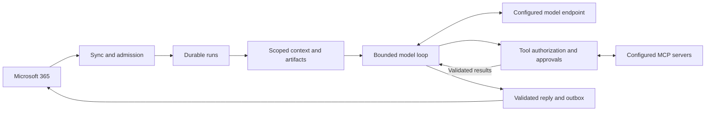

# Architecture

Desired state · 2026-10-01. See the [roadmap](../docs/roadmap/ROADMAP.md) for delivery and [implementation evidence](../docs/implementation.md) for current support.

One runtime owns one mailbox agent: its instruction bundle, policy, credentials, connections, and private state directory. Microsoft Graph handles email; a model adapter handles inference; MCP clients expose configured capabilities. Keep these behind small interfaces with runtime-local configuration. Additional agents run in separate processes or containers.

The Node.js service uses the Vercel AI SDK for one normalized Chat Completions inference step at a time and the official MCP TypeScript SDK for connections. Mail Agent owns the bounded loop, policy gates, approvals, SQLite jobs, action fences, and outbox. The inference SDK never executes tools or sends mail.

| Boundary | Owns |
| --- | --- |
| Runtime lifecycle | Startup, queue processing, concurrency limits, shutdown and health |
| Mail adapter | Incremental intake, clean thread turns, drafts, attachments, send reconciliation |
| Agent engine | Instruction snapshot, bounded context, validated model/tool loop, honest response |
| Policy and action ledger | Sender admission, resource access, recipients, exact approvals, action outcomes |
| Artifact service | Run-scoped input/output handles, validation, provenance, expiry |
| MCP adapters | Business records, domain permissions, authoritative mutations and conflicts |
| Runtime store | Queue, checkpoints, runs, approvals, action ledger, outbox and audit |
| Setup and diagnostics | Validated bundle generation, safe dependency probes, categorized errors and corrective steps |

Diagnostics reuse the same configuration and adapter boundaries as the runtime. Offline checks never construct live clients; explicit live probes use synthetic input and perform no mail sends or business mutations. Diagnostic results contain safe codes and evidence scope, not provider bodies. Local health/status report synchronization progress separately from provider acceptance and recipient arrival.

Use one private SQLite database and artifact directory for operational state. This state requires backup. The queue, checkpoints, conversations, approvals, actions, and outbox belong exclusively to this deployment. Business records remain in their owning systems.

HTTP pools and credential caches belong to this runtime. Local MCP servers are dedicated child processes with private configuration/state; remote MCP sessions use scoped credentials. Nothing automatically shares connections or state with another deployment. Access to a common external business system must be explicitly configured. [MCP sessions](https://modelcontextprotocol.io/specification/2025-11-25/basic/transports).

Bound concurrent runs and queue size; serialize ordinary requests within each conversation. Deployment requires one active runtime owner per mailbox.

Persist admitted messages before advancing synchronization checkpoints. Deduplicate by agent, mailbox, and immutable message ID; serialize ordinary runs within a conversation. Build chronological, sender-labelled context from clean message bodies, filtered for the current actor's visibility. The current admitted sender supplies request authority; quoted messages supply context only.

Each admitted message creates a bounded run. Load its instruction snapshot, build context, call the model, and normalize its output into a reply or schema-validated tool calls. Recheck policy, execute permitted calls, append their results, and repeat within the original budgets. The model proposes; only the runtime executes or sends. Automatic and approved actions use the same executor. Persist mutation intent before execution and confirmed results before continuing.

| Run state | Meaning |
| --- | --- |
| Queued / running | Admitted work waiting for capacity or executing |
| Awaiting approval | Exact action persisted; release execution capacity until a decision |
| Ready to send | Reply and artifact references persisted in the outbox |
| Completed | Runtime finished and provider accepted the reply; recipient delivery remains unproven |
| Failed / uncertain | Definite failure or unresolved external outcome; no blind replay |

Approvals use local operator commands through a private socket while the daemon runs, or direct state access while stopped. Recheck requester and approver authority before resumption. An optional verified email-approval extension must route controls to the referenced pending action, bypassing ordinary conversation ordering. A waiting run must not block its own approval.

Final replies, refusals, exhausted budgets, and uncertain actions terminate model execution. Budget exhaustion or uncertainty produces a deterministic status from confirmed results, without another model call. Run state, business-action outcomes, and mail delivery status remain separate.

Context contains runtime rules, ordered operator instructions, the current request, bounded relevant thread turns, selected artifacts, allowed tool schemas, and current-run tool results. Reserve output space; discard oldest historical turns first and cap tool results with visible truncation. Never silently truncate the current request or instructions: oversize input gets a clear rejection. Preserve source references. Budgets remain cumulative across restarts and approval waits.

MCP supports pinned stdio and authenticated Streamable HTTP connections, with namespaced tools. Ordinary servers use dedicated externally restricted credentials; every admitted sender must be authorized for that connection's entire resource scope. A reviewed domain adapter adds per-sender visibility, governed writes, and revision checks where needed. Trusted actor context travels through that adapter's explicit contract, never invented tool arguments. Connectivity alone provides no domain authorization.

Core memory is bounded recent thread context plus operational state. Durable knowledge, personal memory, search, and archives are optional MCP capabilities with provenance and deletion contracts. Defer summaries and vector indexing until real threads require them.

Admission separates verified identity/recipient authority from supported request formats. Unauthorized mail stays silent; authenticated authorized unsupported requests may enter a bounded deterministic explanation path without model/tool access or attachment processing. Reply eligibility must preserve the original identity and recipient gates.

Artifacts cross adapters through scoped upload/download contracts. Tool-returned paths or URLs never authorize arbitrary access. Image transcription produces `.txt` output with provenance; PDF input uses isolated bounded rendering or a document MCP, and richer output uses a processor. The outbox binds exact artifacts and recipients before delivery; broader mailbox grants belong to explicitly enabled file recipes.
